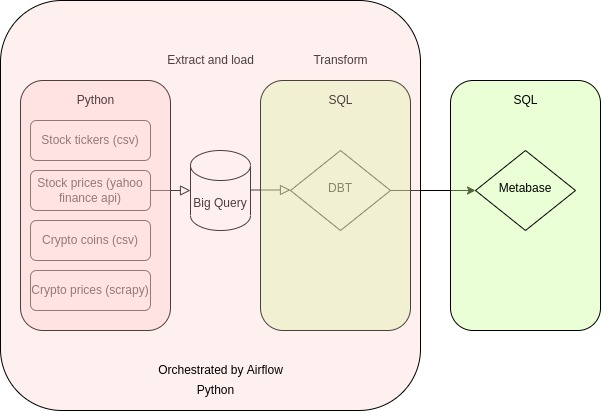
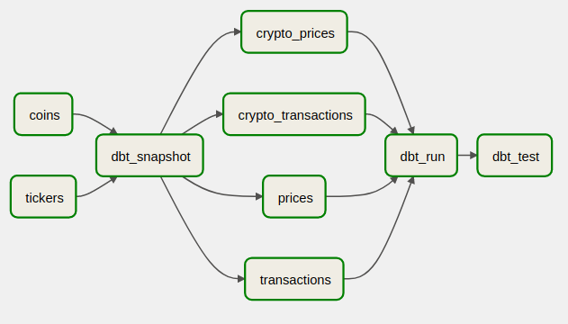
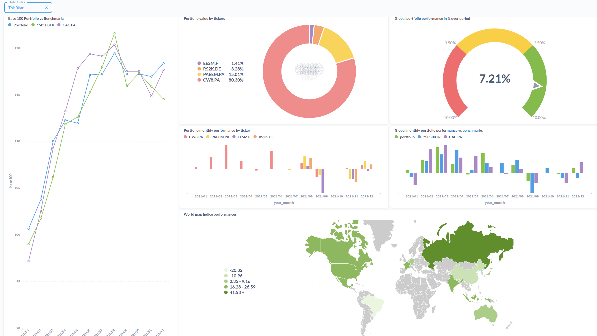

<h1>PEA Tracker</h1>
<h2>What does this project do?</h2>

There is plenty of portfolio app/websites around but few of them allow you to benchmark your portfolio performance versus a custom index.

<h2>What technologies were used to make this project?</h2>

<h3>Extract and load</h3> 

Custom python scripts using yahoo finance API / scrapy (web crawling) loading data to Big Query.

<h3>Transform</h3>
DBT and SQL to transform the data directly inside of Big Query (the T of ELT)

<h3>Dataviz</h3>
Metabase and SQL for the data vizualition part.

Each component was isolated inside of a docker container and booted up with Docker-compose. Everything is hosted on a cheap VPS.

<h3>General diagram</h3>

<h3>Airflow DAG</h3>

<h3>Metabase dashboard</h3>

